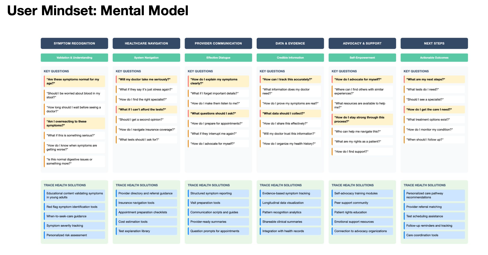
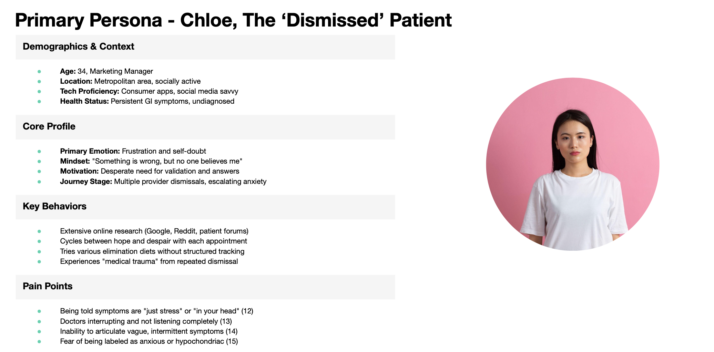
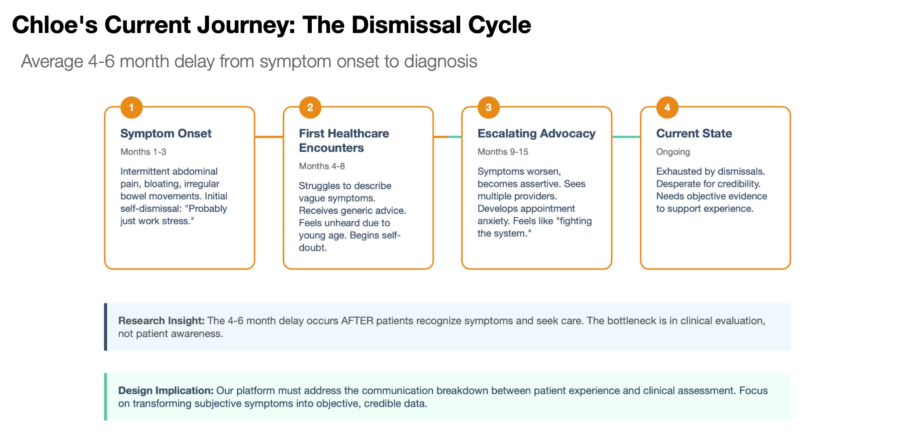
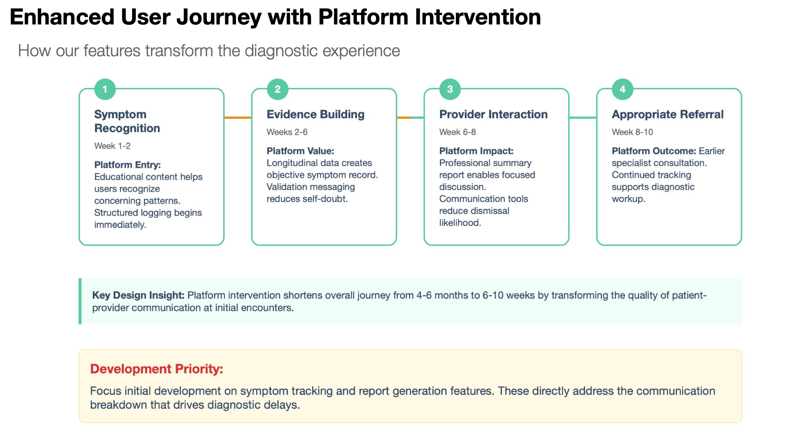
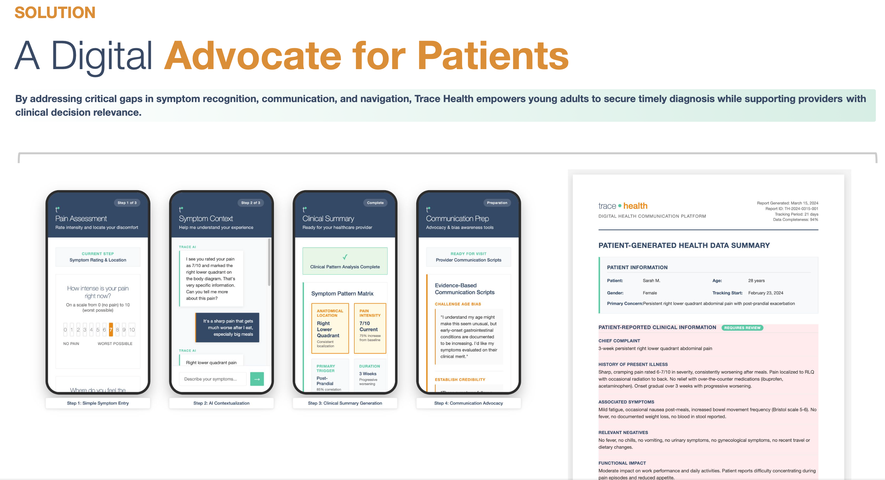

# The Connection Became Clear When...

Watching someone you love struggle with serious digestive health issues changes your perspective on healthcare. When my girlfriend faced life-threatening GI complications, I saw firsthand how much coordination and layers of communication goes into obtaining a frightening diagnosis then have it turn into a path toward healing. But it was during my Hopkins graduate studies that the broader pattern became clear that younger patients with early-onset symptoms consistently faced systematic dismissal that led to dangerous diagnostic delays.

This personal experience connected to a much larger problem: 70 million Americans with digestive symptoms encounter a healthcare system that often doesn't believe them. Through interviews with patients, providers, and researchers, I discovered systemic challenges affecting both sides from patients struggling to be taken seriously and providers facing real constraints around screening protocols and compliance. The connection between individual suffering and systemic failure revealed an opportunity to for a solution that could transform ["testimonial injustice"](https://en.wikipedia.org/wiki/Epistemic_injustice) into evidence-based advocacy.

# My Role

* Conducted extensive independent research into 4-6 month diagnostic delay patterns affecting young adults with GI symptoms, using mixed-method approach including 14 patient interviews, 6 provider interviews, and systematic literature review of 45+ studies

* Applied design thinking methodology and thematic analysis to identify "testimonial injustice" as core user problem, performing competitive analysis across 8 digital health platforms to inform positioning strategy

* Created go-to-market strategy including persona development and user journey mapping, identifying \$59M TAM with evidence-based design principles for healthcare communication barriers

* Built financial models demonstrating \$270K cost savings per prevented late-stage diagnosis, with detailed roadmap from bootstrap MVP to Series A expansion

# Results

-   Developed product strategy with validated market opportunity and clear competitive differentiation

-   Created detailed user personas and journey maps based on clinical research and patient advocacy insights

-   Designed comprehensive product roadmap with realistic resource allocation and milestone-based development timeline

-   Built compelling business case demonstrating both clinical impact and economic viability

**What I learned:** This project taught me how to translate complex healthcare problems into structured product opportunities where the technology was new to me while maintaining deep empathy for patient experiences.

**Why I stepped away:** This research revealed both the magnitude of the healthcare challenge and the complexity of building solutions in this space. After completing the strategy work, I made the decision to focus on gaining product management experience at established companies driving software solutions in patient care delivery more closely. I recognized that successfully executing a vision of this scope would require deeper industry expertise in healthcare technology, regulatory pathways, and scaling digital health products - skills I'm now building through my career progression.

{alt="Strategic product design showing how Trace Health features transform the diagnostic timeline from a 4-6 month dismissal cycle to a focused 6-10 week evidence-building process, demonstrating clear value proposition and development priorities."}

