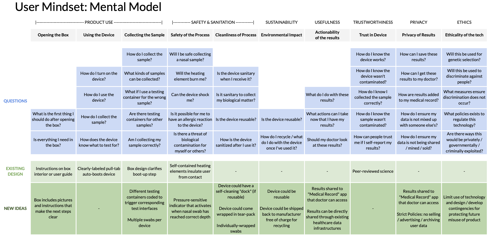
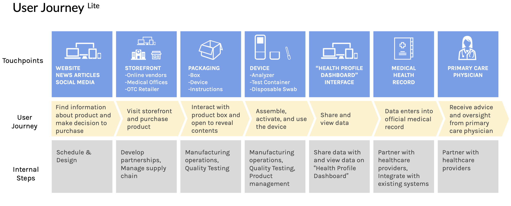
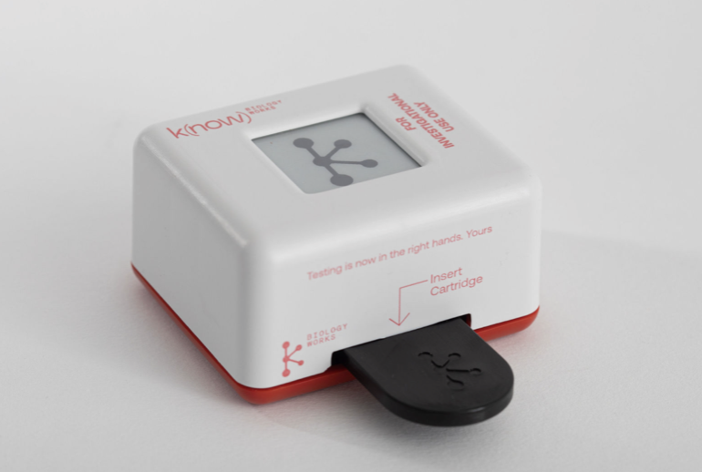
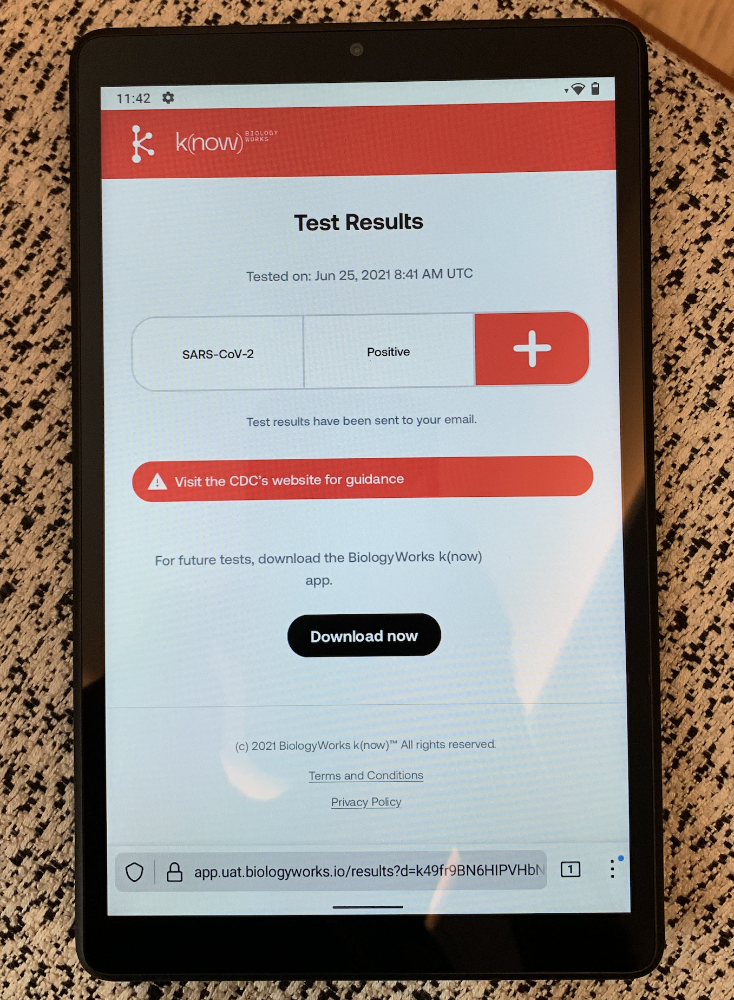

# The Journey Began...

Six months before the COVID-19 pandemic took the world by storm, I had the great fortune of a trio of entrepreneurs taking an interest in some unique diagnostic patents I had generated earlier in my career while at Monolythix. We had a shared vision to make diagnostics accessible to everyone and everywhere then built up a company, BiologyWorks, together with some of his friends. Suddenly, I found myself helping to get a business plan together, conducting market analysis, diving deep into understanding the user journey, and convincing others that we are worth their investment. We were successful in gaining funding and suddenly the pandemic took off but that was only the beginning. A whole journey ensued after in bringing up a laboratory, forming a team, developing a product, and then taking it to market.

# My Role

* Led customer discovery through 20+ stakeholder interviews with patients, laboratory technicians, and clinical partners, conducting competitive analysis across 10+ molecular diagnostic platforms to validate market opportunity and inform product positioning strategy

* Translated stakeholder workflow insights and regulatory pathway research into technical product specifications, serving as technical product manager coordinating cross-functional team of 6 across engineering, regulatory, and business functions

* Created product roadmaps with measurable OKRs and milestone-based resource allocation that maintained 14-month delivery timeline despite pandemic supply chain disruptions

* Implemented structured communication protocols across laboratory staff, engineering teams, and C-suite executives, ensuring strategic alignment between technical capabilities, regulatory requirements, and business objectives

# Results

* Delivered [99.1% accurate COVID-19 diagnostic test](https://www.businesswire.com/news/home/20220116005038/en/BiologyWorks-know-COVID-19-Clinical-Trial-Matches-99.1-Accuracy-to-RT-PCR-Tests) in 14 months during global pandemic

* Secured \$11M seed funding from investor pitches and \$100K Gates Foundation grant through value propositions demonstrating clinical impact and market viability to diverse stakeholder groups

* Collaborated successfully with clinical providers to integrate novel diagnostic technology into existing workflows, conducting user research and workflow analysis to ensure successful clinical adoption

* Established functional laboratory and development infrastructure from ground zero

* Built and managed high-performing cross-functional team during remote-work constraints

